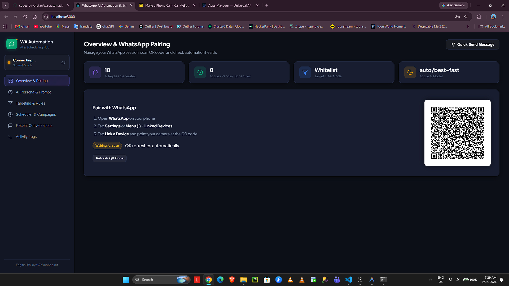
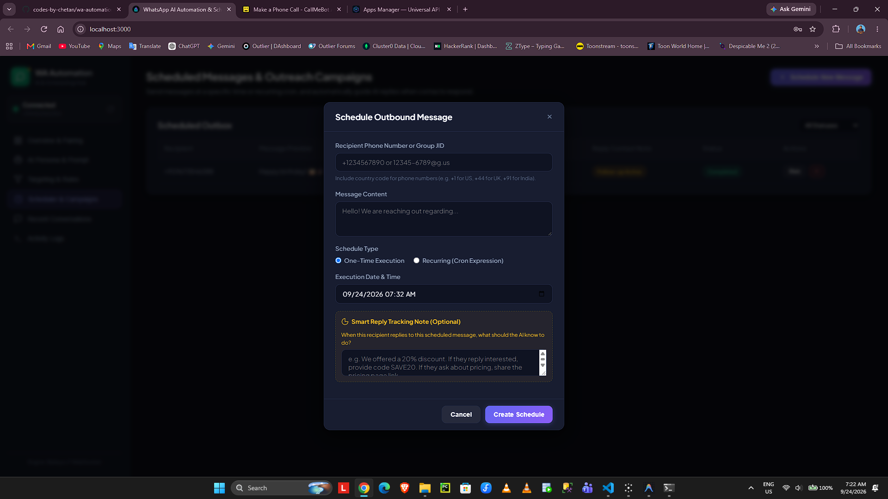
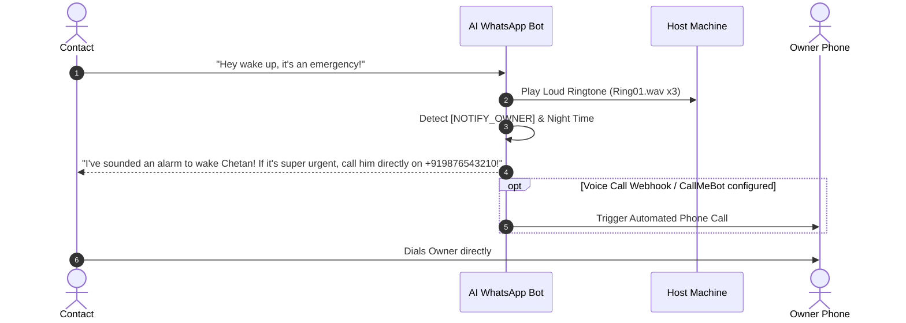

<div align="center">

# ⚡ WhatsApp AI Automation & Autonomous Outreach Agent

An enterprise-grade, privacy-first **WhatsApp Automation Engine** powered by modern Large Language Models and Baileys multi-device protocol. Features real-time AI auto-replies, context-aware persona switching, automated outreach scheduling, anti-ban safeguards, and a physical emergency wake-up alarm system.

[](https://www.typescriptlang.org/)
[](https://nodejs.org/)
[](https://github.com/WhiskeySockets/Baileys)
[](https://sqlite.org/)
[](LICENSE)

<br/>



</div>

---

## 🌟 Highlights & Capabilities

- 🤖 **Native AI Agent Persona**: Texts like a real human companion on your personal WhatsApp—smart, casual, and witty.
- 🌙 **Time & Sleep Awareness**: Automatically knows when it's late night (10:00 PM – 7:00 AM) and informs contacts that you are probably asleep, taking messages or routing emergencies.
- 🚨 **Emergency Wake-Up Protocol**:
  - Detects urgent messages ("wake up", "emergency", "call him").
  - Triggers a **loud physical phone ringtone** (`Ring01.wav` repeated 3x) directly through your host PC/laptop speakers.
  - Automatically redirects urgent callers to **directly dial your real phone number**.
  - Built-in support for automated voice call triggers (CallMeBot / Twilio webhooks).
- 🎯 **Granular Targeting & Filters**: Choose who gets auto-replies—*Contacts Only*, *Groups Only*, strict *Whitelist*, *All Messages*, or *Disabled*.
- 🛡️ **Anti-Ban Safeguards**: Configurable cooldown delays per contact, realistic typing simulation (`composing...` presence status), and deduplication buffers.
- 📅 **Outreach Campaign Scheduler**: Schedule one-time or recurring (Cron) outreach messages. Automatically attaches campaign context so AI intelligently follows up when contacts reply.
- 💻 **Glassmorphic Web Dashboard**: Sleek, real-time dark-mode web control center to pair QR codes, monitor live conversation threads, tweak system prompts, and inspect logs.
- 🔌 **Universal LLM Compatibility**: Drop-in compatible with any OpenAI-compatible API: **OmniRoute**, **NVIDIA NIM**, **Ollama**, **Groq**, **OpenRouter**, **DeepSeek**, or **OpenAI**.

---

## 📸 Web Dashboard & Feature Walkthrough

### 1. Connection & Session Manager
Pair WhatsApp in seconds via QR code, check real-time multi-device connection status, and manage active sessions:
<div align="center">
  
</div>

### 2. AI Persona & LLM Endpoint Configuration
Fine-tune your model parameters, test completions live in the playground, and connect any OpenAI-compatible provider:
<div align="center">
  
</div>

### 3. Targeting, Filters & Emergency Wake-Up Protocol
Control exactly where auto-replies trigger (Contacts, Groups, or Whitelist) and configure emergency wake-up call alerts:
<div align="center">
  
</div>

### 4. Scheduled Messages & Outreach Campaigns
Schedule one-time greetings or recurring cron messages with automatic AI conversation tracking when contacts reply:
<div align="center">
  
</div>

---

## 🚀 Quick Start Guide

### 1. Prerequisites
- **Node.js**: v18.0.0 or later (v20+ recommended)
- **Package Manager**: `pnpm` (recommended), `npm`, or `yarn`
- A phone with an active WhatsApp account

### 2. Clone and Install
```bash
git clone https://github.com/codes-by-chetan/wa-automation.git
cd wa-automation
pnpm install
```

### 3. Configure Environment Variables
Copy the example environment file and customize your configuration:
```bash
cp .env.example .env
```

Edit `.env` with your preferred settings:
```env
PORT=3000
HOST=0.0.0.0

# Your name (auto-detected from WhatsApp if left blank)
OWNER_NAME=Chetan

# Active LLM Provider
LLM_BASE_URL=http://127.0.0.1:20128/v1
LLM_API_KEY=your_api_key_here
LLM_MODEL=auto/best-fast

# Emergency Wake-Up Contact Number (with international country code)
EMERGENCY_NUMBER=+919876543210

# Optional CallMeBot API key or custom Voice Webhook
CALLMEBOT_API_KEY=
EMERGENCY_CALL_WEBHOOK_URL=
```

### 4. Build and Run
```bash
# Compile TypeScript code
pnpm run build

# Start the automation server
pnpm start
```

### 5. Pair WhatsApp
1. Open your browser and navigate to `http://localhost:3000`.
2. Open **WhatsApp** on your mobile device &rarr; tap **Linked Devices** &rarr; **Link a Device**.
3. Scan the QR code displayed on the web dashboard.
4. Your bot is now active and monitoring incoming chats!

---

## 🧠 LLM Provider Configuration Guide

The engine supports any **OpenAI-compatible `/v1/chat/completions` API endpoint**. You can switch providers either inside `.env` or in real-time from the **AI Persona & Model** tab in the Web Dashboard.

### 1. OmniRoute (Local AI Router)
[OmniRoute](https://github.com/omniroute) routes traffic to your optimal local or cloud models with low latency.
```env
LLM_BASE_URL=http://127.0.0.1:20128/v1
LLM_API_KEY=sk-your-omniroute-key
LLM_MODEL=auto/best-fast
```

### 2. NVIDIA NIM (NVIDIA Inference Microservices)
Experience lightning-fast inference on Llama 3.3, Mixtral, and Nemotron via [build.nvidia.com](https://build.nvidia.com):
```env
LLM_BASE_URL=https://integrate.api.nvidia.com/v1
LLM_API_KEY=nvapi-your-nvidia-api-key
LLM_MODEL=meta/llama-3.3-70b-instruct
```

### 3. Ollama (100% Local & Free)
Run local open-source models completely offline on your own machine:
```bash
# Start your desired model in terminal
ollama run llama3.2:3b
```
Then configure:
```env
LLM_BASE_URL=http://127.0.0.1:11434/v1
LLM_API_KEY=ollama
LLM_MODEL=llama3.2:3b
```

### 4. Groq (Ultra Low-Latency Cloud)
Incredible generation speeds (< 200ms) with [GroqCloud](https://console.groq.com):
```env
LLM_BASE_URL=https://api.groq.com/openai/v1
LLM_API_KEY=gsk_your-groq-api-key
LLM_MODEL=llama-3.3-70b-versatile
```

### 5. OpenRouter
Access 200+ models from Claude, OpenAI, DeepSeek, and Mistral through a single API key:
```env
LLM_BASE_URL=https://openrouter.ai/api/v1
LLM_API_KEY=sk-or-v1-your-openrouter-key
LLM_MODEL=deepseek/deepseek-chat
```

### 6. OpenAI
Standard OpenAI GPT-4o and mini models:
```env
LLM_BASE_URL=https://api.openai.com/v1
LLM_API_KEY=sk-proj-your-openai-key
LLM_MODEL=gpt-4o-mini
```

---

## 🚨 Emergency & Wake-Up Protocol

When someone urgently needs to contact you while you are asleep or away:



### Key Safety Rules:
- **No Self-Spam**: If you test from your own emergency number, the bot will not send redundant SOS text messages back into your own chat.
- **Physical Ringing Sound**: Windows hosts run a synchronous `powershell` audio playback loop playing `C:\Windows\Media\Ring01.wav` at max device volume.
- **Direct Redirection**: The AI explicitly provides your phone number so the person can call your cellular line without waiting for automated retries.

---

## 📁 Repository Structure

```
wa-automation/
├── assets/                  # Documentation images & dashboard previews
│   ├── dashboard-preview.png
│   └── whatsapp-chat-demo.png
├── src/
│   ├── config.ts            # Environment constants & defaults
│   ├── index.ts             # Application entrypoint
│   ├── core/
│   │   ├── whatsapp.ts      # Baileys multi-device socket & connection manager
│   │   └── messageHandler.ts# Message parsing, debounce, & response pipeline
│   ├── server/
│   │   ├── app.ts           # Express REST API endpoints
│   │   └── public/          # Glassmorphic web dashboard (HTML/CSS/JS)
│   ├── services/
│   │   ├── alert.ts         # Sound playback, SOS dispatcher & call webhook
│   │   ├── llm.ts           # OpenAI client, dynamic persona & prompt templates
│   │   ├── ruleEngine.ts    # Whitelist, blacklist, & mode filter evaluation
│   │   └── scheduler.ts     # Cron-based outreach & context manager
│   └── storage/
│       └── db.ts            # SQLite database schema, settings, & logs
├── .env.example             # Configuration blueprint
├── .gitignore               # Strict ignore rules for auth, data, & env
├── package.json
└── tsconfig.json
```

---

## 🔒 Privacy & Security

- **Self-Hosted Credentials**: All WhatsApp session auth keys (`data/auth_baileys/`) are stored locally on your machine and strictly ignored in `.gitignore`.
- **Zero Cloud Tracking**: Conversations, campaign context, and logs reside solely in your local SQLite database (`data/automation.sqlite`).
- **No Third-Party Meta Business API**: Connects directly via WebSocket without monthly Meta API fees or template approvals.

---

## 🛠️ Useful Scripts

```bash
# Start in development mode with hot-reloading
pnpm run dev

# Compile TypeScript to dist/
pnpm run build

# Start production build
pnpm start
```

---

## 🤝 Contributing

Contributions, feature requests, and suggestions are welcome! Feel free to open an issue or submit a pull request.

---

## 📄 License

This project is licensed under the [MIT License](LICENSE).
